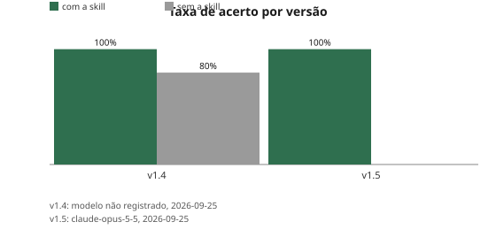
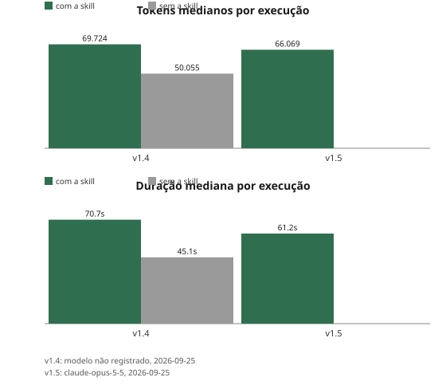

# conductor

Uma [Agent Skill](https://support.claude.com/en/articles/12512176-what-are-skills) do Claude Code que orienta o processo de spec development de ponta a ponta — de uma ideia solta até código revisado — para qualquer projeto, novo ou legado.

## O problema que resolve

O pipeline de skills de spec development ([mattpocock/skills](https://github.com/mattpocock/skills)) é poderoso mas fragmentado: `wayfinder` sabe planejar descoberta, `grilling`/`domain-modeling` sabem sharpen de plano, `to-spec` sabe sintetizar spec, `planning-and-task-breakdown` sabe quebrar em tarefas, `implement-specs` sabe implementar, `check-impl-against-spec` sabe revisar — mas nenhuma delas sabe dizer "você está aqui, o próximo passo é ali". É fácil pular uma etapa sem perceber.

O `conductor` é essa peça que faltava: lê o estado real do projeto (specs existentes, tarefas, convenções do próprio repo) e diz exatamente qual skill chamar agora — sem nunca decidir por conta própria disparar as skills mais sensíveis (interrogatório, publicação de spec), que continuam exigindo confirmação explícita.

### Em que difere do `ask-matt` (mattpocock/skills)

O `mattpocock/skills` já tem seu próprio roteador, [`ask-matt`](https://github.com/mattpocock/skills/blob/main/skills/engineering/ask-matt/SKILL.md) — um mapa em prosa de cenário → sequência de skills, cobrindo bem mais fluxo (bugs, handoff, fronteiras de fase) do que este projeto tenta modelar. O `conductor` não substitui isso: a diferença é que `ask-matt` é estático (a mesma prosa pra qualquer projeto), enquanto o `conductor` lê o estado real do repositório atual — `CLAUDE.md`, `tasks/plan.md`, git log, milestones/issues — antes de recomendar. Os dois se complementam: `ask-matt` (ou equivalente) como vocabulário do pipeline, `conductor` como leitura de onde o projeto está de fato.

## Instalação

Copie a pasta `conductor/` para `~/.claude/skills/conductor/` (escopo global — funciona em qualquer projeto automaticamente, sem configuração por repositório):

```bash
git clone <url-deste-repo> ~/.claude/skills/conductor
```

Não depende de nenhuma configuração adicional. Funciona melhor com o pipeline do [mattpocock/skills](https://github.com/mattpocock/skills) instalado (`wayfinder`, `grilling`, `grill-with-docs`, `domain-modeling`, `to-spec`, `planning-and-task-breakdown`, `implement-specs`, `check-impl-against-spec`), mas o catálogo (`scripts/catalog.sh`) se adapta a qualquer skill instalada, lendo o frontmatter de cada `SKILL.md` em tempo real.

## Como funciona

1. **Lê a convenção do projeto atual** — `CLAUDE.md`/`AGENTS.md`, ou equivalentes de outras ferramentas (`.cursor/rules/*.mdc`, etc.), com precedência sobre o fluxo genérico.
2. **Determina o estado real** — existe modelo de domínio? spec formal? tarefas quebradas com critério de aceite? implementação em andamento? Distingue projeto novo de projeto legado maduro sem processo formalizado (usando sinais como histórico de commits e, quando necessário, minerando ~3 commits de mudanças parecidas pra achar a convenção praticada de fato).
3. **Monta o catálogo de skills disponíveis** dinamicamente (`scripts/catalog.sh`) e cruza com a ordem de estágios documentada em `references/pipeline-stages.md`.
4. **Recomenda o próximo passo** — chama direto as skills automáticas, devolve o comando exato para as manuais (`wayfinder`, `to-spec`, `grill-with-docs` continuam exigindo confirmação sua, por design).
5. **Avalia skills novas** propostas para o pipeline, comparando contra o que já existe e contra precedentes já registrados no próprio projeto.
6. **Mantém os artefatos vivos do processo** (board de fases, diagrama de arquitetura, fluxo de tela, artefato de QA) acompanhando sua fonte de verdade no repositório — a ferramenta é escolha do usuário (Notion é só uma opção entre outras); o `conductor` nunca assume uma por padrão.

Ver `SKILL.md` para o processo completo.

## Estrutura

```text
conductor/
├── SKILL.md               — instruções e frontmatter (nome, description, gatilhos)
├── references/
│   └── pipeline-stages.md — tabela de estágios do pipeline de spec e como avaliar skill nova
├── scripts/
│   └── catalog.sh         — lista nome/description/invocação-manual de toda skill instalada
└── evals/
    └── evals.json         — casos de teste usados para validar o comportamento da skill
```

## Qualidade

Avaliada com o framework de eval do `skill-creator`: cada rodada roda os mesmos casos com e sem a skill em projetos sintéticos isolados. O baseline já tem **todas as skills de SDD instaladas** — a pergunta é se o `conductor` agrega em cima delas.

**Ganho** (taxa de acerto, com a skill vs. sem ela, por versão):



**Custo** (tokens e duração medianos por execução, por versão):



Gerados por `scripts/generate_benchmark_charts.py` a partir de `evals/benchmarks/<versão>.json` — nunca mantidos à mão; rode o script de novo a qualquer momento para reproduzir a partir dos mesmos dados. Uma versão sem a comparação `with_skill`/`without_skill` (ex: v1.5, que reaproveita o baseline sem skill da v1.4 porque não mudou o comportamento da skill) aparece só com a barra que tem. Uma run por configuração e grading pelo mesmo modelo que desenvolve a skill — metodologia, resultado por caso e limites em [`docs/avaliacao.md`](docs/avaliacao.md).

## Licença

[MIT](LICENSE).
